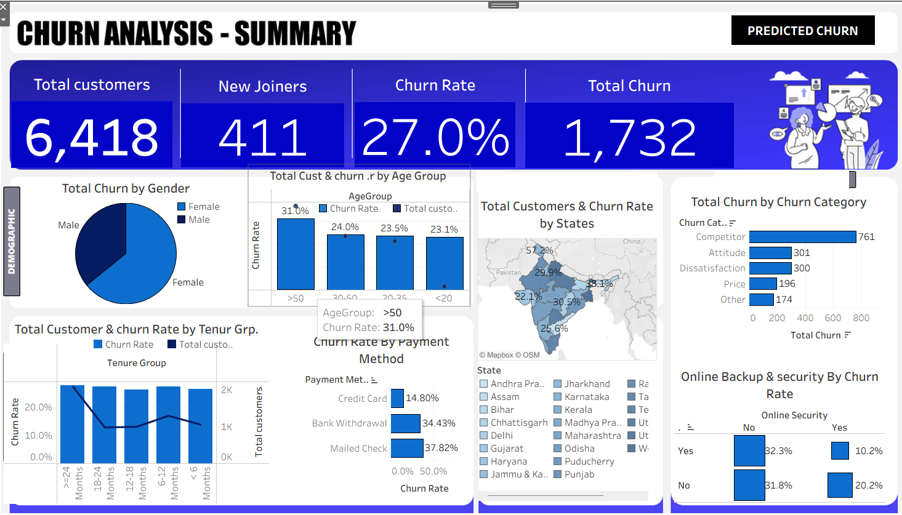

# Tabeleau-End-to-End-Churn-Analysis-Portfolio-Project-
This end-to-end Customer Churn Analysis project integrates data engineering, business intelligence, and machine learning to identify customers at high risk of leaving. The workflow spans SQL Server (ETL + data cleaning), Tableau (business insights), Python (machine learning), and Tableau (predictive visualization)

Dashboard :
The attached images showcase two key dashboards.

displays predicted churn by demographics: 1,036 females and 572 males predicted to churn, broken down by tenure groups, payment methods (top 10 states shown), age, marital status, and contract type.​

summarizes totals (6,418 customers, 411 new joiners), churn rate (27.0%), total churn (1,732), geographic distribution by state, and churn by payment method.​

 # Key Insights:

* Females (1,036) outnumber males (572) in predicted churn, with top states like Tamil Nadu (154) and Maharashtra (148) showing high risk.​

* Churn rate stands at 27.0% across 1,732 customers, with geographic hotspots in Andhra Pradesh, Karnataka, and Uttar Pradesh; online security absence correlates with 20% churn.​

* New joiners total 411, while tenure and payment breakdowns reveal patterns like higher churn in certain contracts and bank transfers.​​

# Tools Used:

*  **ETL & Cleaning:** SQL Server for data extraction, transformation, views (e.g., vw_ChurnData), and filtering churn statuses.​

*  **Dashboarding:** Tableau for summary KPIs , maps and Tableau for advanced visuals like donut charts by gender/churn and measure values.​

*  **ML Prediction:** Python Random Forest classifier outputting churn probabilities, integrated into Tableau for segmentation.​

**Additional: Tableau calculations for churn rates, counts (e.g., SUM(IF [Churn Predicted Status] = "churn" THEN 1 END)), and distinct customers.**

 # Project Workflow 📁

**Data Engineering (SQL Server)** – Cleaned data, handled missing values, created features and analytical views.

**Exploratory Analysis (Tableau)** – Built dashboards to visualize churn patterns, customer segments, and KPIs.

**Machine Learning (Python)** – Trained Random Forest to predict churn; evaluated model performance.

**Predictive Visualization (Tableau)** – Visualized churn probabilities, high-risk groups, and feature importance.

**Deliverables** – SQL scripts, cleaned dataset, Tableau dashboards, Python model, and project documentation.

# workflow diagram

*SQL Server (ETL & cleaned data)

*Import raw CSV → staging tables → cleaning & transformations → final churn table/views (e.g., vw_ChurnData).​

*Tableau

* Connect Tableau to SQL Server → build churn summary, demographics, tenure, payment, and state dashboards.​

* Google Collab (Python Random Forest)

* Read cleaned data from SQL Server (via pyodbc/sqlalchemy) into pandas.

* Do feature engineering, train RandomForestClassifier, generate predictions (Customer_ID, churn_flag, churn_probability).

* Predictions back to Tableau

* Save predictions as CSV or write back to a SQL Server table (e.g., churn_predictions).

* Connect Tableau to this predictions data, join on Customer_ID, and build “Predicted Churn Profile” and “Customers at Risk” dashboards.​

## If you want, a new diagram image can be generated with boxes: “SQL Server → Tableau → Goggle Collab → Tableau (Predictions).”

